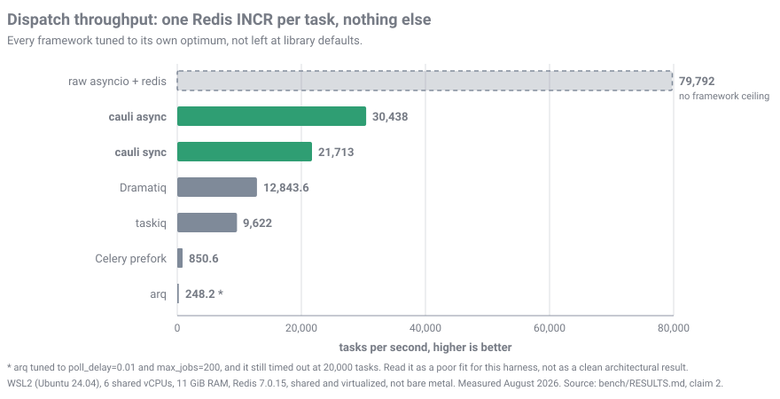

<p align="center">
  
</p>

<h1 align="center">cauli</h1>

<p align="center">
  <a href="#license"></a>
  
  
  
</p>

**Background tasks for Python, executed by a single Rust worker.**

You write the tasks in Python. One Rust binary runs them. Async tasks,
blocking tasks and CPU bound tasks all live in the same worker process, and
one flag sets the concurrency for all three. Redis is the broker and the
result store.

cauli is for FastAPI and Django teams who want a Celery alternative with an
async native client, one worker process to operate instead of a pool per
workload, and a slot cost measured in threads rather than in forked
processes.

## Key features

- **One flag.** `-c 50` is 50 tasks in flight, not 50 processes. Process,
  thread and slot counts derive from it. `cauli-worker --print-plan` shows the
  derivation, with no Redis and no app.
- **Three lanes, one worker.** `async def`, `def` and `kind="cpu"` run side by
  side in the same process. There is no `-P` pool flag to pick.
- **Async native enqueue.** `await send_email.adelay(...)` never blocks your
  event loop.
- **Cheap concurrency.** 10,000 I/O tasks held in flight cost 215.7 MiB of
  memory, measured. See [Benchmarks](#benchmarks), including where that loses.
- **At least once delivery, always.** Redis Streams consumer groups plus a
  visibility timeout. A `kill -9` at 160 of 500 tagged tasks lost 0 of them.
- **Framework integrations.** `cauli.contrib.django` gives Celery fixup parity
  and `delay_on_commit`. `cauli.contrib.sqlalchemy` gives a session per task
  for FastAPI, Starlette and Litestar.
- **Safe beat.** Schedule state lives in Redis behind a leader lease, so two
  `cauli-beat` replicas produce one task per slot.
- **Frozen wire format.** The envelope and the Redis key layout in
  [PROTOCOL.md](PROTOCOL.md) are fixed for the 1.x series.
- **Tasks stay callable.** `crunch([1, 2])` runs inline with no broker and no
  eager mode setting.

## Installation

```bash
pip install cauli
```

That is the whole install. `cauli` pulls the prebuilt `cauli-worker` binary
and pip puts it on PATH inside your virtualenv. No Rust toolchain, no cargo,
no compiler, no second step. Check it with `cauli-worker --print-plan`, which
needs no Redis and no app.

Worker wheels cover Linux on x86_64 and aarch64, glibc 2.35 or newer, CPython
3.10 through 3.14, on an interpreter built with `--enable-shared` (python.org,
the Docker `python:*` images, distro packages, uv). musl (Alpine), conda and
the free threaded build have no worker wheel.

The client installs and enqueues everywhere, macOS and Windows included. Only
the worker is Linux only. A web process that never runs tasks can skip the
binary:

```bash
pip install --no-deps cauli 'redis>=5' 'msgspec>=0.18'
```

Full packaging rules live in [PROTOCOL.md](PROTOCOL.md) section 13.

## Quickstart

Define the tasks:

```python
# myproj/tasks.py
from cauli import Cauli

app = Cauli(redis_url="redis://localhost:6379/0")

@app.task(max_retries=5)
def send_email(to: str):
    ...

@app.task()                       # async def just works
async def call_api(url: str):
    ...

@app.task(kind="cpu", timeout=120)
def crunch(data: list[int]):
    ...
```

Enqueue from anywhere:

```python
from myproj.tasks import send_email

result = send_email.delay("a@b.com")
result.get(timeout=10)
```

Run the worker:

```bash
cauli-worker -A myproj.tasks:app -c 50
```

`-A` takes `module:attr`, not a module. `-c 50` is 50 tasks in flight, the
unit Sidekiq and Hangfire use. Add `--print-plan` to see the processes,
threads and slots it derives before it starts.

### FastAPI

Build the app as `AsyncCauli` and await the enqueue, so a slow Redis cannot
stall the event loop.

```python
# myproj/tasks.py
from cauli import AsyncCauli

cauli = AsyncCauli(redis_url="redis://localhost:6379/0")

@cauli.task(max_retries=5)
async def send_email(to: str) -> None:
    ...
```

```python
# myproj/api.py
from contextlib import asynccontextmanager

from fastapi import FastAPI

from myproj.tasks import cauli, send_email

@asynccontextmanager
async def lifespan(api: FastAPI):
    yield
    await cauli.aclose()

api = FastAPI(lifespan=lifespan)

@api.post("/signup")
async def signup(email: str):
    result = await send_email.adelay(email)
    return {"task_id": result.id}
```

`AsyncCauli` is a `Cauli`, so `.delay()` and `.get()` keep working on the same
app and the envelope is byte for byte identical either way. Use one
`AsyncCauli` per event loop, because `redis.asyncio` binds its pool to the
loop that first uses it. `await result.aget(timeout=10)` is the awaitable
twin of `.get()`.

### Django

`cauli.contrib.django` builds the app from your settings module and gives you
the enqueue every Django codebase eventually wants: one that does not fire if
the transaction rolls back.

```python
# myproj/tasks.py
from cauli.contrib.django import django_app

app = django_app("myproj.settings")

@app.task()
def send_receipt(order_id: int): ...
```

```python
# in a view, inside transaction.atomic()
order = Order.objects.create(...)
send_receipt.delay_on_commit(order.id)
```

The task publishes when the transaction commits, and not at all if it rolls
back. Arguments are validated at the call site, not at commit time, so a value
that cannot be serialized raises inside your `atomic()` block and rolls the
transaction back with it. A deferred check would instead raise at COMMIT with
the row already written.

One thing that catches everyone: under `django.test.TestCase` nothing is ever
enqueued, because the test itself runs inside an atomic block that always
rolls back. Wrap the assertion in
`self.captureOnCommitCallbacks(execute=True)`, or subclass
`TransactionTestCase`. With pytest-django the `db` fixture behaves like
`TestCase` and `transactional_db` behaves like `TransactionTestCase`.

## Benchmarks



*WSL2 (Ubuntu 24.04), 6 shared vCPUs, 11 GiB RAM. A shared virtualized box,
not bare metal with isolated cores. Measured August 2026. Every number on this
page comes from [bench/RESULTS.md](bench/RESULTS.md), which reports the losses
too.*

### The environment, because a number without one is a rumor

- **Hardware: WSL2 (Ubuntu 24.04), 6 shared vCPUs, 11 GiB RAM.** Shared and
  virtualized. Redis, PostgreSQL, every worker under test and the harness
  driving all of it compete for the same 6 cores. Treat every number here as
  directional.
- Redis 7.0.15 on a dedicated bench instance. PostgreSQL 16 on a dedicated
  role and database.
- Competitors, pinned: Celery 5.6.3, taskiq 0.12.4 with taskiq-redis 1.2.3,
  arq 0.28.0, dramatiq 2.2.0, redis-py 8.1.0, psycopg 3.3.4, psycopg2-binary
  2.9.12, gevent 26.5.0, uvloop 0.22.1.
- Redis ceiling on the same box: `redis-benchmark -t set,get,incr -n 200000 -c
  50` gives **INCR 76,628 ops/s, p50 0.303ms**. Read every dispatch number
  against that, not in isolation.
- Method: drain rate, not a live producer racing the consumer. Preload N
  tasks with no worker running, start the worker, take the slope of
  completions between the 10th and 90th percentile of the run. Latency is open
  loop. Every framework is tuned to its own optimum, not left at defaults.

### Dispatch throughput

Task body is one `redis.incr` and nothing else, so this isolates enqueue,
fetch, dispatch and ack from any real work.

| Lane | Best config | Tasks per second |
|---|---|---:|
| raw asyncio and redis, no framework | batch 16, concurrency 64 | 79,792 |
| **cauli async** | `--procs 8 --io-concurrency 96` | **30,438** |
| **cauli sync** | `--procs 12 --io-threads 80 --io-concurrency 80` | **21,713** |
| Dramatiq | `--processes 12 --threads 8` | 12,843.6 |
| taskiq | `--workers 8 --max-async-tasks 100 --max-prefetch 100` | 9,622 |
| Celery prefork | `-c 4 -P prefork --prefetch-multiplier=1` | 850.6 |
| arq | `poll_delay=0.01, max_jobs=200` | 248.2 |

cauli sync is 25.5x Celery sync and 1.7x Dramatiq. cauli async is 3.2x taskiq.
Against the no framework ceiling, cauli's async lane captures 38% of 79,792
tasks per second. The other 62% is real framework cost: envelope building,
JSON encode and decode, retry and idempotency bookkeeping, consumer group ack.

Two caveats that belong next to that table. **The arq ratio is not a clean
architectural comparison.** arq's default `poll_delay=0.5` capped it at 26.9
tasks per second; tuning it 50x down recovered 9.2x, and the run still timed
out at 20,000 tasks. Read it as a poor fit for this harness, not as a verdict
on arq. **Celery gevent measured flat at 77 to 84 tasks per second at every
concurrency setting**, because a queue that always has backlog never gives
gevent a blocking socket call to yield on. That is gevent working correctly on
the wrong workload, not a Celery defect.

Backlog drain at scale: 1,000,000 preloaded tasks, cauli sync, all 1,000,000
completed with no timeout, **18,994 tasks per second sustained across the full
52.6 second drain**. Slightly below the 21,713 measured at 100,000 tasks.

### Memory per unit of concurrency

PSS, not RSS, summed across every worker process. RSS counts Celery prefork's
copy on write pages once per child and would have quietly biased this in
cauli's favour.

| Tasks in flight | cauli async | Celery prefork | Celery gevent | Celery threads |
|---:|---:|---:|---:|---:|
| 100 | 58.8 MiB | 2,036.7 MiB | **46.7 MiB** | **45.7 MiB** |
| 1,000 | 156.9 MiB | not attempted | **68.2 MiB** | **72.3 MiB** |
| 5,000 | 183.2 MiB | not attempted | **164.4 MiB** | 193.5 MiB |
| 10,000 | **215.7 MiB** | not attempted | 282.9 MiB | 341.3 MiB |

**cauli loses this below roughly 4,500 to 6,000 tasks in flight.** Celery with
`-P gevent` or `-P threads` is one OS process with N greenlets or threads, and
it is cheaper than cauli until the crossover. cauli's floor is higher because
it always runs a supervisor plus one or more worker processes, each embedding
its own CPython. It wins past the crossover because its marginal cost is about
6.6 KiB per held task against 19 to 30 KiB for either single process pool. The
Celery prefork rows above 100 were not attempted: the extrapolation is about
20 GiB, which exceeds this box's RAM.

### CPU bound work

`kind="cpu"` against Celery prefork, taskiq with a process pool, Dramatiq and
arq. All five at 6 processes, matching the core count.

| Task size | cauli | Celery | taskiq | Dramatiq | arq |
|---:|---:|---:|---:|---:|---:|
| 0.5ms | **2,664.8/s** | 778.4/s | 810.5/s | 1,539.5/s | ~567/s |
| 2ms | **1,776.6/s** | 693.2/s | 763.2/s | 1,188.7/s | ~551/s |
| 10ms | 516.5/s | 413.0/s | 515.6/s | 473.3/s | 335.1/s |
| 50ms | 115.3/s | 110.8/s | 117.6/s | 117.3/s | 119.0/s |

This is the physics, and the suite predicted it before running it. Dispatch
overhead is a shrinking fraction of total time as the task grows. **At 50ms
all five frameworks are within noise and no framework is meaningfully ahead.**
At 10ms taskiq ties cauli. Only at small task sizes does the lead matter. The
arq figures are elapsed over count, not the slope method used everywhere else,
because arq's completions arrive in one late burst.

### Correctness under a hard crash

`kill -9` the worker at 160 of 500 uniquely tagged tasks, restart it, count
what comes out.

| Lane | Lost permanently | Duplicates | Recovery |
|---|---:|---:|---:|
| cauli | **0** | 0 | 34.0s |
| Celery, `acks_late=True`, `visibility_timeout=5` | 0 | 0 | 103.2s |
| Celery, plain default | 80 of 500 (16%) | 0 | never recovered |
| Dramatiq, default config | 85 of 500 (17%) | 0 | timed out at 60s |
| arq, default config | 400 of 500 (80%) | 0 | timed out at 60s |

Celery's `acks_late` path is eventually correct and 3x slower to recover, and
the reason is not a misconfiguration in the harness:
`kombu.transport.redis.QoS.restore_visible` restores at most 10 stale messages
per scan, and the scan fires on 1 invocation in 10. Dramatiq and arq were run
at their default reliability configuration and were not given the tuned second
pass Celery got. arq's 80% loss is measured, not root caused.

### Where cauli loses, in its own words

A benchmark table that only shows wins is rigged. These are carried over from
[bench/RESULTS.md](bench/RESULTS.md) unchanged.

| Result | Number |
|---|---|
| **SQLAlchemy async ORM: taskiq wins** | taskiq 733.6/s against cauli 378.6/s on the same insert. Root caused to SQLAlchemy's greenlet based async engine, which did not scale with added concurrency here. External to cauli, and still a loss. |
| **Memory below the crossover** | Celery gevent and threads are cheaper than cauli up to roughly 4,500 to 6,000 tasks in flight. See the table above. |
| **CPU bound parity at 50ms** | All five frameworks within noise. taskiq ties cauli at 10ms. |
| **The wrong config stalls under a CPU burst** | With a 50ms CPU burst injected every 3 seconds, cauli's naive async lane pushed light task p99 latency to 18 to 19x baseline. Routing the burst to `kind="cpu"` brings that to 4.0x, which beats arq at 4.4x, Dramatiq at 5.1x and Celery prefork at 14.5x. The naive number is what you get if you do not route CPU bound work, and it is the worst in the table. |
| **Throughput falls off a cliff, it does not degrade** | Above 104 slots per process on `--io-concurrency`, or 112 threads per process on `--io-threads`, a run reaches 91 to 99% and then hangs until timeout instead of slowing down. The suite's tuned configs stay inside those limits. |
| **Django needs pgbouncer, at any real concurrency** | cauli's Django ORM lane reaches 3,171.7/s against Celery prefork's 162.4/s, but only through pgbouncer. Direct to Postgres at the same config it exhausts `max_connections`. Django has no connection pool, and the same wall hits Celery with enough prefork workers. |

### What is not measured

Stated because absence is not evidence. The full list is in
[bench/RESULTS.md](bench/RESULTS.md) under "Not yet done".

- **No soak result exists.** A 48 hour soak was started and killed by a host
  outage partway through, and the CSV did not survive. Memory over a long run
  is unverified and this project does not claim otherwise.
- **No published latency table.** The open loop harness works, the results
  table does not exist yet. The one datum that does exist: p50 hit 9.7 seconds
  the moment load exceeded the sustainable rate.
- **No CPU pinned re measurement**, apart from one mixed workload retest.
  Everything else on this page is a shared box measurement.
- **No duplicate delivery test**, no Redis round trip time sweep beyond
  localhost, no payload size sweep, no retry rate lane, no result round trip
  latency, no graceful shutdown or backpressure numbers.

### Rerun it

```bash
cd bench
./setup.sh                    # builds cauli-worker fresh, pinned venv, dedicated redis and pg
python3 campaign.py --reps 3
```

Needs Linux, Redis, PostgreSQL and Rust. `setup.sh` never touches a Redis or
Postgres instance you already run. The Django and SQLAlchemy lanes need a
pgbouncer in `transaction` pool mode as well, and the exact config used is in
[bench/README.md](bench/README.md). Read
[bench/CLAIMS.md](bench/CLAIMS.md) first: it states what each measurement is
allowed to prove.

## How cauli compares

| Pick this instead | When |
|---|---|
| **Celery** | You need chains, groups, chords, priorities or rate limits. You need a broker that is not Redis, or Redis Cluster, or a worker on macOS, Windows or Alpine. You want Flower, `celery inspect` or `celery purge`. You run fewer than roughly 4,500 tasks in flight and memory is the binding constraint, where `-P gevent` costs less than cauli. |
| **Dramatiq** | You want a pure Python worker with no compiled binary in the dependency tree, and 12,843.6 tasks per second of dispatch is plenty. It was the strongest sync competitor measured here. |
| **taskiq** | Your task bodies go through SQLAlchemy's async ORM, where it measured 733.6/s against cauli's 378.6/s. Or your work is CPU bound at 10ms or larger per task, where it ties or wins. |
| **arq** | You already run it happily and it is fast enough. This suite could not get it past 248.2 tasks per second of dispatch and it lost 400 of 500 tasks on a `kill -9` at default settings, neither of which was root caused, so treat both as this harness's result rather than a settled verdict. |

Pick cauli when you hold many I/O tasks in flight, mix async, blocking and CPU
bound work in one codebase, want at least once delivery without opting in, and
can live with Linux only workers and Redis only brokers.

## Migrating from Celery

Most of the surface ports directly: `@app.task()`, `.delay()`,
`.apply_async(countdown=..., queue=...)`, `AsyncResult`, `.get(timeout=...)`,
and a beat process for periodic work. Five differences are worth knowing
before you start, and the first two change a schedule without raising:

- `crontab()` uses `cron(8)` field order, so its third and fourth positional
  arguments are the reverse of Celery's. Three or more positional arguments now
  raise instead of building a different schedule.
- `crontab()` ORs `day_of_month` and `day_of_week` when both are restricted,
  the way `cron(8)` does. Celery ANDs them.
- `-c` counts tasks, not processes. A Celery operator who copies their `-c`
  across gets far more concurrency than expected, and a database connection
  count to match.
- Every task retries 3 times by default. A Celery task that relied on the
  default of no retry now retries.
- Arguments are JSON only. A `UUID`, a `datetime`, a `Decimal` or a model
  instance raises `TypeError` at the call site.

[docs/MIGRATING-FROM-CELERY.md](docs/MIGRATING-FROM-CELERY.md) has the full
mapping table, the eight divergences that bite silently, the list of what cauli
does not do, and a migration order that works.

## Documentation

| Document | Contents |
|---|---|
| [docs/CONFIGURATION.md](docs/CONFIGURATION.md) | Every flag, setting and environment variable, plus the tuning guide |
| [PROTOCOL.md](PROTOCOL.md) | Wire format, Redis keys, worker semantics and the non goals |
| [docs/MIGRATING-FROM-CELERY.md](docs/MIGRATING-FROM-CELERY.md) | What ports directly, what changes silently, and what cauli does not do |
| [CHANGELOG.md](CHANGELOG.md) | Known limitations, what is still open, and upgrade notes for 1.0 |
| [worker/ARCHITECTURE.md](worker/ARCHITECTURE.md) | How the worker is built |
| [bench/README.md](bench/README.md) | The benchmark suite, its claims and its measurements |

## Limitations

Stated plainly, before you adopt it. The full list is "Known limitations" in
[CHANGELOG.md](CHANGELOG.md), and "Still open" just above it.

- **Redis only, standalone only.** No RabbitMQ, no SQS, no database backend.
  The worker sends `INFO cluster` at startup and exits 1 on Redis Cluster,
  because delayed and retried tasks would be lost silently there.
  `CAULI_ALLOW_REDIS_CLUSTER=1` overrides it. Sentinel is reachable from the
  Python client and `cauli-beat` but the worker connects by URL and never looks
  a master up again after a failover.
- **Redis must be persistent and must never come back empty.** The stream, its
  consumer group, the pending entries list and the delayed sorted set are the
  only copy of accepted work. Run with AOF. The worker recreates missing
  consumer groups on its own, and that recovers the groups, not the work.
- **Delivery is at least once, with no way to turn it into at most once.**
  Worst case executions of one task are `(max_retries + 1) x
  (redelivery_limit + 1)`, which is 20 on the defaults. Task bodies must be
  safe to repeat.
- **No chains, groups, chords, rate limits or task priorities**, and none are
  planned for 1.x.
- **The stats log line is the whole operator interface.** No metrics endpoint,
  no JSON logging, no health endpoint, no queue depth field, no dashboard.
  Scraping means parsing a log line.
- **A hard timed out sync thread is lost until the process restarts**, along
  with any database connection it holds. CPython has no safe way to stop a
  running thread. Use `kind="cpu"` for work that must be killable.
- **A wedged event loop costs a process restart**, taken automatically after
  15 seconds of no progress. In flight tasks are redelivered.
- **No Python `atexit` handler ever runs.** The worker leaves through an
  immediate process exit, deliberately: running C library atexit handlers while
  Python threads are live is what produced the heap corruption incident this
  design was shaped by. Sentry and OpenTelemetry users must flush explicitly.
- **Memory over a long run is unverified.** The only soak in the tracked
  benchmark suite was killed by an environment outage and never produced a
  verdict.

Three details people check first:

- **TLS works.** `rediss://` connects from both halves. The worker links
  rustls and trusts the platform certificate store, so Upstash, Azure Cache
  and ElastiCache with encryption in transit need no build flag.
- **`.delay()` is synchronous Redis I/O.** Inside an async handler it blocks
  the loop for up to the client's 5 second socket timeout when Redis degrades.
  `AsyncCauli` with `await task.adelay(...)` is the way out.
- **cpu child memory is invisible in `rss_mb`.** That field covers the worker
  process only. `--cpu-max-tasks-per-child` defaults to 1000 and is the only
  bound on a child's memory.

## Status

cauli 1.0.0, the first public release. 1.0 means the wire format in
[PROTOCOL.md](PROTOCOL.md) and the stats line key set are frozen for the 1.x
series. It does not mean a decade of production mileage.

## License

Apache-2.0 or MIT, at your option. See `LICENSE-APACHE` and `LICENSE-MIT`.
